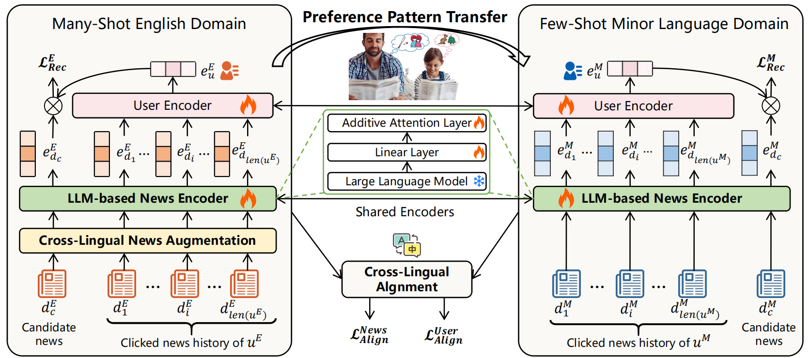

# PPT: A Minor Language News Recommendation Model via Cross-Lingual Preference Pattern Transfer

[](https://aclanthology.org/2025.acl-long.526/)  
[](LICENSE)

> **TL;DR**  
> We introduce **PPT**, a model for minor language news recommendation through cross-lingual preference pattern transfer. This repository provides the implementation for model training, replication of experimental results, and evaluation.

---

##  📄 Paper

- [PPT: A Minor Language News Recommendation Model via Cross-Lingual Preference Pattern Transfer (ACL 2025)](https://aclanthology.org/2025.acl-long.526/)
- [Yiyang Zhang](https://yiyangzhang-hz.github.io/)<sup>1</sup>, [Nan Chen](https://openreview.net/profile?id=~Nan_Chen13)<sup>1</sup>
  <sup>1</sup>USTC 
- 

---

## 📦 Installation & Dependencies

We recommend using **Conda** to manage dependencies:

```python
# Create a new environment named "PPT"
conda create -n PPT python=3.10 -y

# Activate the environment
conda activate PPT

# Install dependencies from requirements.txt
pip install -r requirements.txt
```

------

## 🧩 Data Tokenization

To perform data tokenization, run:

```
python ./process/mind/processor_unitokv3.py
```

- The processed results will be saved in the `./data_mine` directory.
- For convenience, part of the tokenized datasets has already been pre-stored in the `data_mine` folder. 
- **The original dataset and intermediate processing results can be found at the [Google Drive Link](https://drive.google.com/drive/folders/1oO3P1TOolY2pDc8L3OcNczcZdGs-n4lW?usp=drive_link)** .

------

## 📝 Preparation

The purpose of Preparation is to store the token embedding sequences obtained from multiple layers during the encoding process of LLMs. To perform preparation, run:

```
python worker_prep.py --embed config/embed/bert-token.yaml --model config/model/llm/bert-naml.yaml --exp config/exp/bert-split.yaml --data config/data/mind_mine-bert.yaml --version small_sdtd --llm_ver 12l --hidden_size 64 --layer 0 --lora 0 --fast_eval 0 --embed_hidden_size 768
```

-  `--model config/model/llm/bert-naml.yaml` specifics the item encoder and the user encoder. 
-  `--exp config/exp/bert-split.yaml` specifics the caching layers and storing dir.
-  ` --data config/data/mind_mine-bert.yaml` specifies the dataset structure.
-  Please note that **Preparation** needs to be executed separately **on both the English domain and the minor language domain datasets**. The `--version` argument specifies the dataset to be used. In this resource, we take Swahili (SWH) news recommendation as an example: through Cross-Lingual News Augmentation, the English domain corresponds to `small_sdtd+SWH`, while the minor language domain corresponds to `small_etd_td_o_SWH`.

------

## 📊 Training and Testing

To perform training and testing, run:

The purpose of Preparation is to store the token embedding sequences obtained from multiple layers during the encoding process of LLMs. To perform preparation, run:

```
--data_sd config/data/mind_mine-bert-sd.yaml --data_td config/data/mind_mine-bert-td.yaml --embed config/embed/bert-token.yaml --model_sd config/model/llm/bert-naml_sd.yaml --model_td config/model/llm/bert-naml_td.yaml --exp config/exp/tt-llm.yaml --embed_hidden_size 768 --llm_ver 12l --layer 11 --version small_sdtd+SWH --version2 small_etd_td_o_SWH --lr 0.00001 --item_lr 0.000005 --batch_size 32 --acc_batch 2 --epoch_batch -16
```

-  `--data_sd config/data/mind_mine-bert-sd.yaml` specifics the English dataset. 
-  `--data_td config/data/mind_mine-bert-td.yaml` specifics the minor language dataset. 

---

## 📖 Citation

Don't forget to cite this source if it proves useful in your research!

```yaml
@inproceedings{zhang-chen-2025-ppt,
    title = "{PPT}: A Minor Language News Recommendation Model via Cross-Lingual Preference Pattern Transfer",
    author = "Zhang, Yiyang  and
      Chen, Nan",
    booktitle = "Proceedings of the 63rd Annual Meeting of the Association for Computational Linguistics (Volume 1: Long Papers)",
    month = jul,
    year = "2025",
    address = "Vienna, Austria",
    publisher = "Association for Computational Linguistics",
    url = "https://aclanthology.org/2025.acl-long.526/",
    doi = "10.18653/v1/2025.acl-long.526",
    pages = "10728--10745",
}
```
